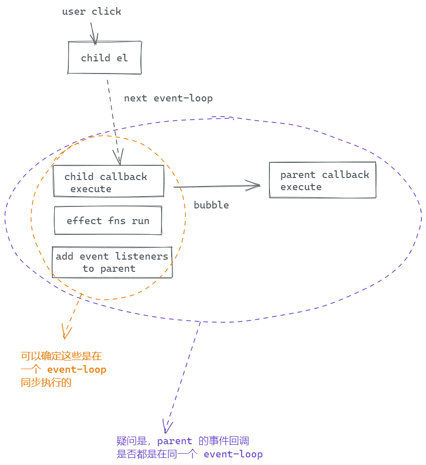

TLDR; 是的，而且是同步执行

之前看到的这篇 Jake Archibald [Tasks, microtasks, queues and schedules](https://jakearchibald.com/2015/tasks-microtasks-queues-and-schedules/) 关于 event-loop 的文章，有一个疑惑，同样是 addEventListener，如果是用户点击触发的，那事件回调就是异步的，如果通过 `el.click()` 这种 javascript 触发的方式则是[同步的](https://jakearchibald.com/2015/tasks-microtasks-queues-and-schedules/#:~:text=event%20to%20dispatch-,synchronously,-%2C%20so%20the%20script)，那冒泡事件的回调和原始事件的回调是不是在同一个 task 中执行呢？

然后前几天看 《Vue.js 设计与实现》中关于绑定事件处理函数是需要做一个判断：[事件的触发时间早于处理函数绑定的时间则不执行处理函数](https://github.com/daolanfler/misc/blob/f0c0478b367c625750f8b4ddccee582ba32a58db/apps/learn-vue3/renderer/main.js#L143)。意思就是：假如我们在原始事件的回调中 **动态地** 去给父元素添加事件绑定，那在这个事件绑定地回调中，要忽略这次事件，那如何区分呢？在这个例子的上下文中，修改响应式数据会同步地触发 `patchElement` 去修改父级元素的 HTML Attributes 和事件监听，顺序是这样的：

&ensp;&ensp;1. 用户点击，触发 `click` 事件  
&ensp;&ensp;2. 子元素的 _onClick callback_ 执行  
&ensp;&ensp;3. 响应式数据的副作用同步触发  
&ensp;&ensp;4. 给父元素 addEventListener (并记录下 attached 的时间)  
&ensp;&ensp;5. 事件冒泡到父元素  
&ensp;&ensp;6. 父元素的 _onClick callback_ 执行 (在这里比较 attaced 时间和事件触发的时间，决定是否执行回调)
  
[view on excalidraw](https://excalidraw.com/#json=eX4hjCwLoLam4-vhV0zAH,GWhL_MCYZdBHZxKZ8zxb3A)  
由于原始事件的触发时间实际上是早于父元素上 `click` 回调的绑定时间，我们可以由此来判断是否要执行回调。

这里刚好可以来验证一下标题中的问题，如果在原始事件地回调中 queue 一个微任务（比如 promise）做一个 log，如果后于父元素地事件回调的 log 的话，就可以证明原始事件的回调和冒泡事件的回调是在同一个 event-loop (task) 中同步执行的。

不过这里有一点需要 **特别注意** 否则可能得出相反的结论: microtask 不仅会在 event-loop 中 task 之后执行也会在 JavaScript excuction context empty 的时候执行[^1]：

> If the [stack of script settings objects](https://html.spec.whatwg.org/multipage/webappapis.html#stack-of-script-settings-objects) is now empty, [perform a microtask checkpoint](https://html.spec.whatwg.org/multipage/webappapis.html#perform-a-microtask-checkpoint)
> — [HTML: Cleaning up after a callback](https://html.spec.whatwg.org/multipage/webappapis.html#clean-up-after-running-a-callback) step 3

<!-- 具体例子看后文，结果证明了原始事件和冒泡事件的确是在同一个 event-loop 中同步执行的。 -->

下面用例子验证一下。

## 例子验证一下

<Stackblitz id="js-hmjac3" />

[open in stackblitz](https://stackblitz.com/edit/js-hmjac3?file=index.js)

通过 `appDiv.click()` **程序式地** 触发事件，log 如下（其中 task(event-loop) 用空行分隔）：

```plaintext

Click: title
Click: bubble to body
Click: bubble to document
in main JS sync log
// 由上可见，通过 el.click() 触发的，3个事件处理回调都是同步执行的

Title: in promise
Body: in promise
in main JS promise
Body: in promise 2
// 微任务紧随其后

Title: in setTimeout
Title: promise in setTimeout
// 新的任务，setTimeout 中的回调会放到不同的 task 中，promise 紧随其后

Body: in setTimeout
// 最后一个任务
```

**注释掉** `appDiv.click()` ，通过用户点击触发事件，log 如下（其中 task(event-loop) 用空行分隔）：

```plaintext
// 代码同步执行
in main JS sync log
in main JS promise

// 点击标题，一个任务执行
Click: title // 第一个事件回调
Title: in promise // 此时 js execution context empty 微任务执行
Click: bubble to body // body 冒泡事件回调执行
Body: in promise // 此时 js execution context empty 微任务执行
Body: in promise 2 // 微任务中触发的微任务继续执行
Click: bubble to document // document 冒泡事件回调执行

// 新的任务
Title: in setTimeout
Title: promise in setTimeout

// 新的任务
Body: in setTimeout
```

通过程序式地触发点击，发现 3 个事件回调在同一个 event-loop 里面同步执行。如果不注意 [^1] 中 microtask 在 execution stack 为空时也会执行，通过用户点击得到的 log 我们会得出相反的结论。

## 文档和标准中的背景知识

- [MDN 的说明](https://developer.mozilla.org/en-US/docs/Web/API/HTML_DOM_API/Microtask_guide#tasks)
- [HTML Standard 的说明](https://html.spec.whatwg.org/multipage/webappapis.html#generic-task-sources) 这个标准里面并没有说哪些 api 会将 task 放到 task queue，哪些会放到 mcirotask queue
  引用 [8.1.6.1 Event Loops Definitions](https://html.spec.whatwg.org/multipage/webappapis.html#definitions-3) 中这段关于 microtask queue 的描述：

  > Each [event loop](https://html.spec.whatwg.org/multipage/webappapis.html#event-loop) has a microtask queue, which is a queue of microtasks, initially empty. A microtask is a colloquial way of referring to a task that was created via the [queue a microtask](https://html.spec.whatwg.org/multipage/webappapis.html#queue-a-microtask) algorithm.

  直白翻译一下：

  > 每个事件循环有一个 mirotask queue，就是一个微任务组成的队列，开始是空的。microtask(微任务) 指的是通过 queue a mircotask 算法创建的 task 的一个口语化的表达

如果一个 task 是通过 [queue a mircotask](https://html.spec.whatwg.org/multipage/webappapis.html#queue-a-microtask) 创造的，则认为它是一个 microtask，否则是一个 task(macro-task)，比如通过 [queue a task](https://html.spec.whatwg.org/multipage/webappapis.html#queue-a-task)。微任务、宏任务只是一个口语化的表达。
