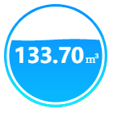
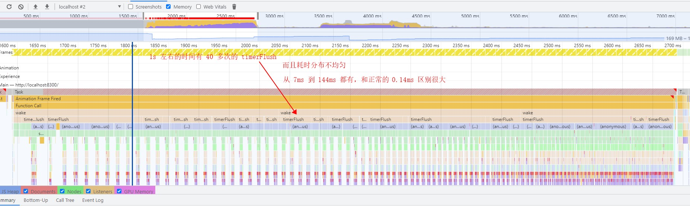
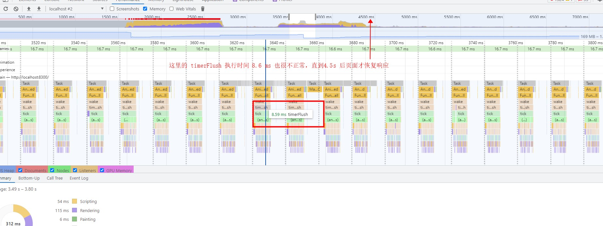
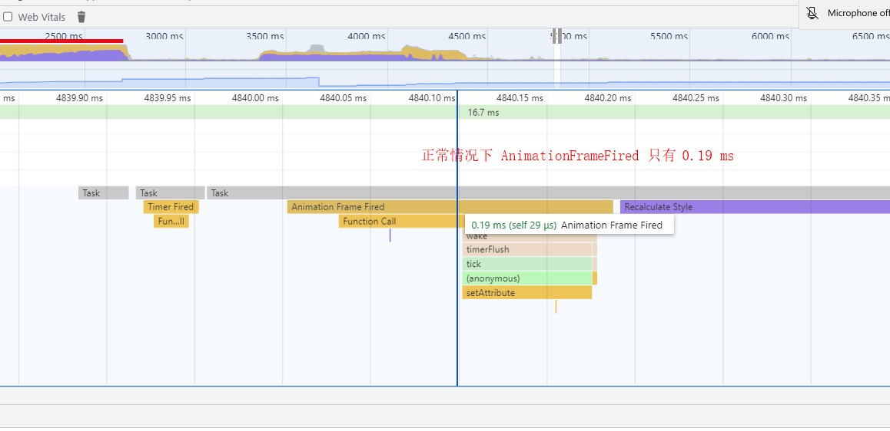

## 水球图的实现

可交互性的示例，请访问 [observehq notebook](https://observablehq.com/d/70713e198a9a835b)



1. 圆环

   使用 [`d3.arc()`](https://github.com/d3/d3-shape/blob/v3.1.0/README.md#arc) 即可以画出圆弧

2. 渐变
   [`linearGradient`](https://developer.mozilla.org/en-US/docs/Web/SVG/Tutorial/Gradients) 在 svg 是一个 element，在 d3 中像对待普通的元素创建它就可以了

   ```js
   const defs = svg.append('defs')
   const grad = defs
     .append('linearGradient')
     .attr('id', gradientId)
     .attr('x1', points[0])
     .attr('y1', points[1])
     .attr('x2', points[2])
     .attr('y2', points[3])
   grad
     .append('stop')
     .attr('offset', '0')
     .attr('stop-color', config.get('gradientFromColor'))
   grad
     .append('stop')
     .attr('offset', '1')
     .attr('stop-color', config.get('gradientToColor'))

   someShape.style('fill', 'url(#' + gradientId + ')')
   ```

3. 值/单位，以及值的变化

   已知开始值和结束值，使用 [`d3.intepolate`](https://github.com/d3/d3-interpolate/blob/v3.0.1/README.md#interpolate) 做一个插值，然后使用 [`transition.tween`](https://github.com/d3/d3-transition/blob/v3.0.0/README.md#transition_tween) 自定义过渡动画中的行为。

   需要注意的是，如果是自定义单位，「值+单位」整体需要水平居中对齐的话，由于 svg 中 `<text>` 中似乎是不能够嵌套 `<text>`，不如 html 中能够在 `<span>` 中嵌套 `<span>` 直接对最外层的 `span` 进行定位，导致这里的排版需要知道单位的文本宽度，可以使用 `text.node().getComputedTextLength()` 拿到，但注意这需要文本已经被渲染之后才可以拿到值。

4. 水波以及波纹动画

   定义一个 `sin(x)` 的 clipPath，水平方向做一个过渡动画，一个周期 x 方向的位移等于 `sin(x)` 周期 x 长度的整数倍，然后重新开始过渡，即可做出水波纹的效果。clipPath 对圆做一个切割，即得到半个水球。具体示例，详见 observehq notebook。

## 性能问题的解决

在项目的某个大屏展示页面上使用了该水球图（5个实例）, 每隔 5s 水球图的数据会更新一次，之后发现，长时间切换到其他浏览器 tab 之后再回到这个页面，或者需要几秒钟才能恢复响应，或者直接崩溃。下面是一个 debug 的记录：

通过观察发现，当页面一直可见时，半小时、一小时之后，页面都没有卡，用浏览器的 performance 查看每一帧（16.6ms) 中水球图动画运行的时间（AnimationFrameFired）只有 0.14ms 左右，也都很均衡，。

当页面打开，并隐藏一段时间（30 分钟左右），再次返回到该 tab，发现页面暂时性的白屏，此时开始 performance 的录制，大概经过 4~5s 之后页面恢复响应，查看每一帧运行中动画脚本运行的时间

- 发现这个 AnimationFrameFired 的的事件非常奇怪：第一次的时候执行了足足有 1s 中，而这 1 秒钟内又有 40 次左右的 timerFlush （d3js 中用来延迟执行回调的函数）执行，而且其执行时间从 7ms 到 144 ms 之间，变化幅度大。

  

- 在这 1s 之后，又有几十次的 AnimationFrameFired , 而这一次每一个 AnimationFrameFired 只有一次 timerflush，且执行时间在 8.5ms 左右，是正常的 20 多倍

  

- 在这之后，时间已经来到了 4.5s , 后面的 AnimationFrameFired 的执行时长才恢复到 0.14ms 的正常水平

  

可见我们找到了页面卡顿的原因！ 之前都是切换其他 tab 去干其他事情了，再回到这个 tab 发现页面卡死了，由于大量的 AnimationFrameFired 在页面唤醒时被执行，在其他页面停留的越久，就越多，导致了页面崩溃！ 而短暂的停留，比如 30 分钟，计算机的性能还能够 handle 只是需要 4.5s 的反应时间, 而过了 12 小时，浏览器则崩溃了也不足为奇。

由此可以设想这是因为当页面隐藏时，浏览器的机制决定了分配给隐藏页面的资源会减少。联想到浏览器有一个 visibilitychange 的事件，查看 [MDN 文档](https://developer.mozilla.org/en-US/docs/Web/API/Page_Visibility_API) 的描述发现 ：

> Most browsers stop sending requestAnimationFrame() callbacks to background tabs or hidden `<iframe>`s in order to improve performance and battery life.

大多数的浏览器都会停止 `requestAnimationFrame` 中回调的执行。页面进入了一个“休眠”的状态，有理由相信，这和我们的页面卡顿有着很强的关联性。于是，监听 visibilitychange 事件，当页面不可见的时候停止 水球图的更新，当页面恢复可见时，恢复动画的更新。

可以下载 [Performance Profile](https://1drv.ms/u/s!AtFTEJuykQUMr3uv8TncSfv_MJiH?e=vbOj9Q) 从 chrome devtools 中打开，即可自行分析。

## 参考

- [原实现，在此基础上做了一些改动](https://github.com/ugomeda/d3-liquid-fill-gauge/blob/master/liquidFillGauge.js)
