## 名词 {#terms}

以下都是预检查，类似于`(?:)`非捕获型分组，匹配到的内容不会被捕获

`(?=pattern)` _Positive Lookahead Assert_ 正向肯定预检查

`(?!pattern)` _Negative Lookahead Assert_ 正向否定预检查

`(?<=pattern)` _Positive Lookbehind Assert_ 反向肯定预检查

`(?<!pattern)` _Negative Lookbehind Assert_ 反向否定预检查

## 温习相关知识

首先了解一下[`RegExp.prototype.exec()`](https://developer.mozilla.org/en-US/docs/Web/JavaScript/Reference/Global_Objects/RegExp/exec#description)这个正则对象的方法。

如果你和我一样对 exec 执行结果中的 groups 对象为啥总是 `undefined` 感到疑问，搜索 [named capturing groups example](https://www.google.com/search?q=named+capturing+groups+example)。下面是一个 regex101 的分析截图：

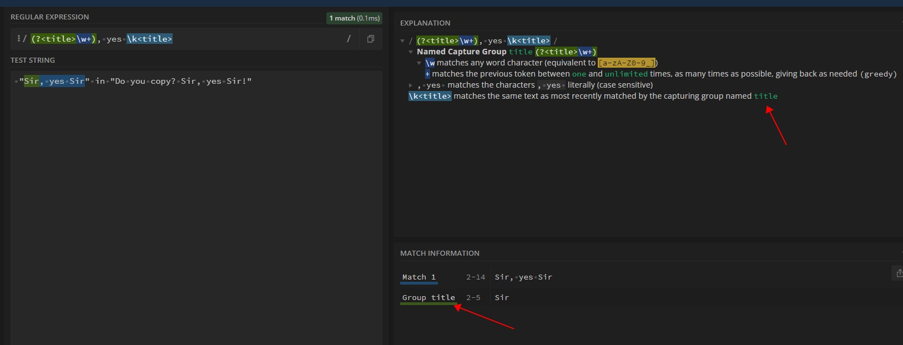

## 例子 1 {#example1}

### 1. 普通的捕获型正则

```js
;/windows(95|NT|xp)/.exec('windows95OtherString')
```

**console：**

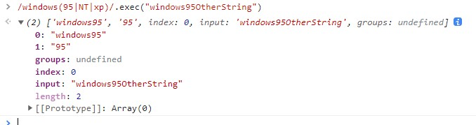

**regex101：**

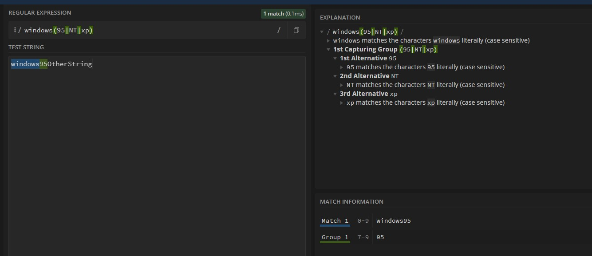

### 2. 正向肯定预检查 Postive Lookahead

```js
;/windows(?=95|NT|xp)/.exec('windows95hahahah')
```

**console：**

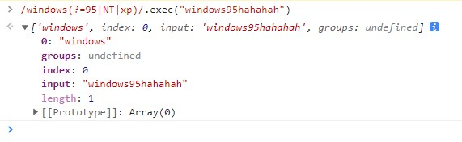

**regex101：**

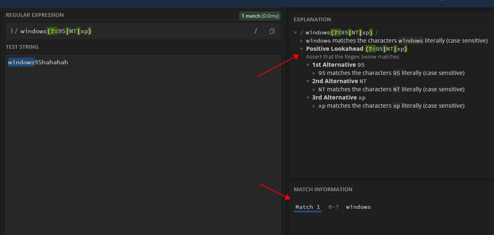

### 3. 正向否定预检查 Negative Lookahead

```js
;/windows(?!95|NT|xp)/.exec('windows10heihei')
```

**console：**

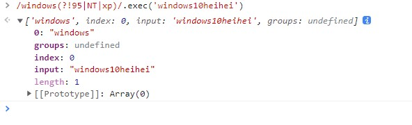

**regex101：**

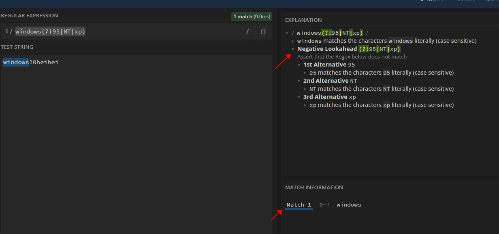

### 4. 反向肯定预检查 Positive Lookbehind

```js
;/(?<=95|NT|xp)windows/.exec('NTwindows')
```

**console：**

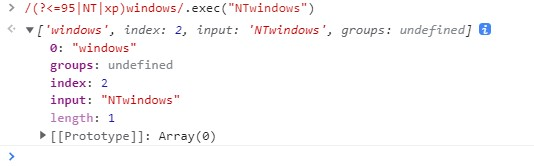

**regex101：**

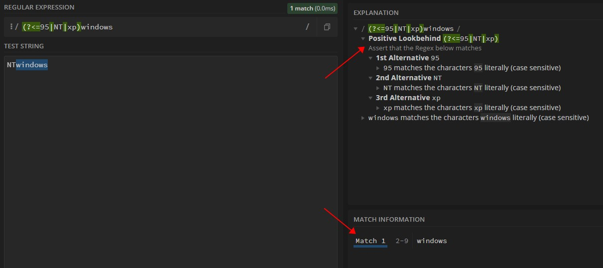

### 5. 反向否定预检查 Negative Lookbehind

```js
;/(?<!95|NT|xp)windows/.exec('haha10windows')
```

**console：**

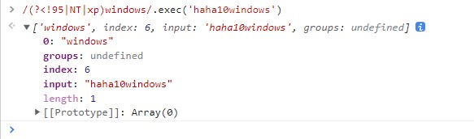

**regex101：**

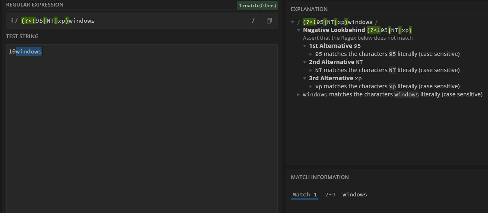

### 总结

其中 `?` 表示非捕获型匹配

以从左到右为正方向，`lookahead` 指的是 _括号里面的正则_ 在 _匹配字符串_ 前方。`lookbehind` 则表示 _括号里面的正则_ 在 _匹配字符串_ 后方，使用`<`来表示在后方。

`Positive` or `Negative` 分表表示 `是` or `否` 匹配括号里的正则。符号分别为 `=` 和 `!`

由于都是 `non-capturing-group`(非捕获型分组)，所以结果匹配到的字符串，都不会包括括号里面的，即上面的例子中的 `windows`。

## 例子 2：千位分隔符 Look Ahead Positive Assert {#example2}

```javascript
'12345678.32423432'.replace(/(\d)(?=(\d{3})+\.)/g, '$1,')
```

**解释：**

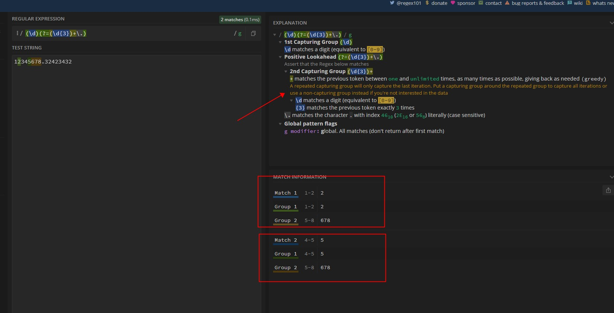

上面的千分位分隔正则表达式对没有小数点部分的字符串无效，更完整的可以使用如下的方法：

```javascript
export function toThousands(num) {
  return num.toString().replace(/\d+/, (n) => {
    return n.replace(/\B(?=((\d{3})+\b))/g, ',')
  })
}
```

## Reference {#reference}

1. <https://segmentfault.com/q/1010000004651380>

2. [PCRE 表达式全集](https://zh.wikipedia.org/wiki/%E6%AD%A3%E5%88%99%E8%A1%A8%E8%BE%BE%E5%BC%8F#PCRE%E8%A1%A8%E8%BE%BE%E5%BC%8F%E5%85%A8%E9%9B%86)

3. [Regex101](https://regex101.com/) 目前为止遇到最强的解释正则工具网站，其他的还有 [RegExr](https://regexr.com/)
