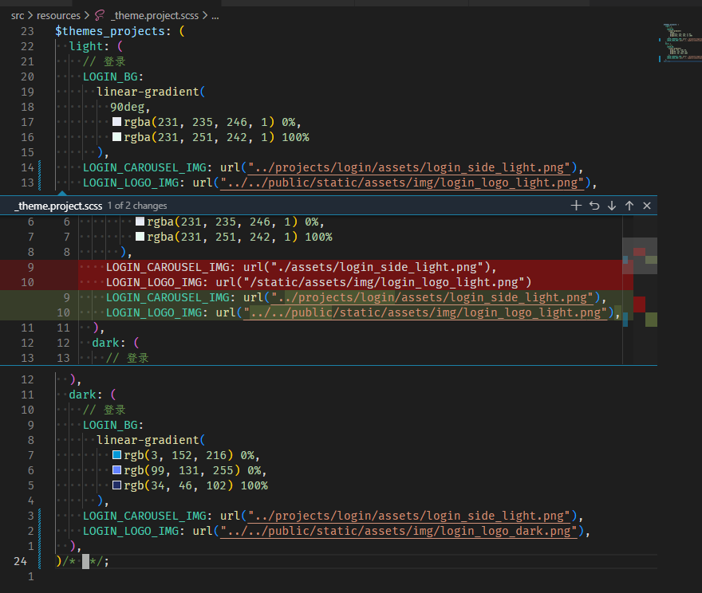
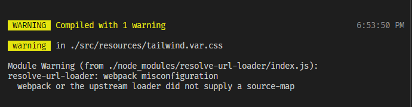

由于 tailwindcss 2.x 少了一些功能，包括 jit 模式也不是正式稳定版。升级到新版需要 postcss 8+ ，但是项目的 vue-cli 还是 4.x 版本的，它依赖的 postcss 还是 7.x.x 版本，索性一起升级（webpack5 也有一些性能提升，dev 启动时间大概能减半）。本以为会按照迁移文档来非常快的事情，没想到插曲还挺多的，所以写个总结记录一下。

- 升级 tailwindcss 到 3.x ，官方文档配合视频基本可以在 30 分钟内解决 （主要升级点 JIT just in time mode，以及 postcss7compatible 中 `!m-2` 这种 important 写法不支持(3.x @apply 写法也不支持 `!h-ful` 但是模板里面可以) 以及 custom 颜色/长度 也不支持）

  主要注意一下 purge 的更改

- 需要升级一下 postcss， vue.config.js 做如下改动

  ```javascript
  {
    css: {
      loaderOptions: {
        scss: {
          additionalData: `@import "@/resources/_handle.scss";`,
        },
        postcss: {
          sourceMap: true,
          postcssOptions: {
            plugins: [require("tailwindcss"), require("autoprefixer")],
          },
        },
      },
    },
  }
  ```

顺便升级一下 vue-cli 的版本 4.x to 5.x

- 根据官方的指南 [迁移手册](https://cli.vuejs.org/migrations/migrate-from-v4.html) 我选择了 updateAll
  - webpack 4 - 5 一系列在 4 中的 pollyfill 不在默认支持，但是可以配置 [参考这个回答](https://stackoverflow.com/questions/64557638/how-to-polyfill-node-core-modules-in-webpack-5)
    应用场景，比如前端代码中使用到了 lowdb
  - webpackDevServer 的 api 更改
- sass-loader 升级到最新 13.x.x
  由于项目中用到了 url 定义的 scss 变量，在这个版本中 url() 存在问题，如果产生的 css 传递给了 `css-loader` 则路径必须是和 entry-file 相对的路径。[根据repo的README](https://github.com/webpack-contrib/sass-loader#problems-with-url) ，这里需要做修改。所以这里的绝对路径不被支持，只能使用相对路径，以 `LOGIN_LOGO_IMG` 为例，这张图片放在 public assets 中，需要使用这个变量的时候，并不知道它的 entry-file 相对于 public assets 路径的位置。所幸 [resolve-url-loader](https://github.com/bholloway/resolve-url-loader) 可以解决这个问题，这个 [issue comment](https://github.com/vuejs/vue-cli/issues/2099#issuecomment-639613478) 提供了在 vue.config.js 中配置 resolve-url-loader 的代码

  

- css-loader 的 [breaking-change](https://github.com/webpack-contrib/css-loader/issues/1136#issuecomment-664984703)
  vue-cli 也升级了 css-loader
  上文有提到，由 sass-loader 传给 css-loader 的必须是一个 relative 的 url，这里提到

  > It is expected and it is breaking change, `/img/slider-arrow-left.png` can mean:
  >
  > - Server relative URLs
  > - Absolute URLs
  >   我不太理解这个 absolute urls 是啥，按照 `` 这种理解，应该是相对于 server public path 的路径啊，难道说 `absolute path` 是指的本地计算机根路径？但是谁没事这么写啊？

- core-js 的报错  
  core-js 的一些模块进行了重命名，安装了一下最新版，[解决了问题](https://github.com/zloirock/core-js/blob/master/docs/2019-03-19-core-js-3-babel-and-a-look-into-the-future.md)
- 一个 resolve-url-loader 报错

    
  由于 在 `index.scss` 文件中引入了 `tailwind.var.css` ，没有检测到相关的 sourceMap ， 把 `tailwind.car.css` 的引入放到 `main.js` 中去即可
