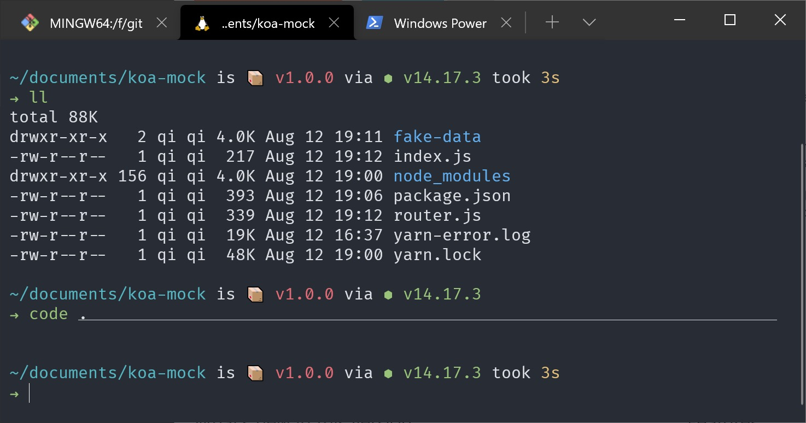

## 开启 wsl 与安装 Ubuntu {#prepare}

详见[官方文档](https://docs.microsoft.com/zh-cn/windows/wsl/install-win10#manual-installation-steps)，最好是 windows pro 专业版，linux 发行版直接从应用商店安装即可

## shell 配置 {#shell-config}

1. 在应用商店下载 Windows Terminal 界面现代化。顺便安利一波 [PowerToys](https://github.com/microsoft/PowerToys)，微软开源的 windows 效率工具合集软件。

   

2. 安装 zsh

   ```bash
   # 安装 zsh
   sudo apt-get install zsh

   # 修改默认的 Shell 为 zsh
   chsh -s /bin/zsh
   ```

3. 安装 oh-my-zsh

   ```bash
   sh -c "$(curl -fsSL https://raw.githubusercontent.com/ohmyzsh/ohmyzsh/master/tools/install.sh)"
   ```

   安装历史记录建议插件[`zsh-autosuggestions`](https://github.com/zsh-users/zsh-autosuggestions)

   ```bash
   # Clone this repository into $ZSH_CUSTOM/plugins (by default ~/.oh-my-zsh/custom/plugins)
   git clone https://github.com/zsh-users/zsh-autosuggestions ${ZSH_CUSTOM:-~/.oh-my-zsh/custom}/plugins/zsh-autosuggestions

   # Add the plugin to the list of plugins for Oh My Zsh to load (inside ~/.zshrc):
   plugins=(
           git
           zsh-autosuggestions
           )

   # 配置生效
   source ~/.zshrc
   ```

   安装语法高亮插件[`zsh-syntax-highlighting`](https://github.com/zsh-users/zsh-syntax-highlighting.git)

   ```bash
   # Clone this repository in oh-my-zsh's plugins directory:
   git clone https://github.com/zsh-users/zsh-syntax-highlighting.git ${ZSH_CUSTOM:-~/.oh-my-zsh/custom}/plugins/zsh-syntax-highlighting

   # Activate the plugin in ~/.zshrc:
   plugins=(
           git
           zsh-syntax-highlighting
           zsh-autosuggestions
           )

   # 配置生效
   source ~/.zshrc
   ```

   安装 [spaceship](https://github.com/spaceship-prompt/spaceship-prompt) 主题

   ```bash
   git clone https://github.com/spaceship-prompt/spaceship-prompt.git "$ZSH_CUSTOM/themes/spaceship-prompt" --depth=1
   # Symlink spaceship.zsh-theme to your oh-my-zsh custom themes directory:
   ln -s "$ZSH_CUSTOM/themes/spaceship-prompt/spaceship.zsh-theme" "$ZSH_CUSTOM/themes/spaceship.zsh-theme"
   ```

   然后再 `.zshrc` 中设置 `ZSH_THEME="spaceship"`

## 命令行代理配置 {#proxy-config}

在 Windows host 上开启了代理服务，如何在 wsl 上也能使用？在 `~/set_proxy`建一个 shell 脚本 ，内容如下：

```bash
#!/bin/zsh
# 获取 windows host 的ip
hostip=$(ipconfig.exe | grep 'vEthernet (WSL)' -A4 | cut -d":" -f 2 | tail -n1 | sed -e 's/\s*//g')

wslip=$(hostname -I | awk '{print $1}')
port=10080
socks5_port=10081

PROXY_HTTP="http://${hostip}:${port}"
PROXY_SOCKS5="socks5://${hostip}:${socks5_port}"

set_proxy(){
  export http_proxy="${PROXY_HTTP}"
  export HTTP_PROXY="${PROXY_HTTP}"

  export https_proxy="${PROXY_HTTP}"
  export HTTPS_proxy="${PROXY_HTTP}"

  export all_proxy="${PROXY_SOCKS5}"
  export ALL_PROXY="${PROXY_SOCKS5}"
}

unset_proxy(){
  unset http_proxy
  unset HTTP_PROXY
  unset https_proxy
  unset HTTPS_PROXY
  unset all_proxy
  unset ALL_PROXY
}

test_setting(){
  echo "Host ip:" ${hostip}
  echo "WSL ip:" ${wslip}
  echo "Current proxy:" $https_proxy
}

if [ "$1" = "set" ]
then
  set_proxy

elif [ "$1" = "unset" ]
then
  unset_proxy

elif [ "$1" = "test" ]
then
  test_setting
else
  echo "Unsupported arguments."
fi

# 添加代理
# git config --global http.proxy "${PROXY_HTTP}"
# git config --global https.proxy "${PROXY_HTTP}"

# 移除代理
# git config --global --unset http.proxy
# git config --global --unset https.proxy
```

然后需要修改文件权限

```bash
# 更改为可执行脚本
chmod u+x ./set_proxy

# 然后在 ~/.zshrc 中添加
alias proxy="source ~/set_proxy"
. ~/set_proxy set

# 然后运行
source ~/.zshrc
# 即可在命令行中使用 proxy 来设置、取消、print 代理设置
```

### 使用 Clash for Windows 如何配置 wsl2 代理 {#cfw-wsl2-proxy}

首选不需要上面提到的 set_proxy 脚本。感谢[这个帖子和回复](https://v2ex.com/t/677083#r_9057511)

- 开启 mixin
- 开启 Tap Device
- 在 cfw 的设置里，编辑 profile mixin

```yml
mixin:
  dns:
    enable: true
    enhanced-mode: redir-host
    listen: 0.0.0.0:53
    nameserver:
      - 8.8.8.8
      - 114.114.114.114
```

如果一切顺利，测试一下 ip 地址：

```bash
➜ curl myip.ipip.net
当前 IP：128.1.134.153  来自于：中国 香港   zenlayer.com
```

如果失败了，查看一下这个文件的内容，应该是这样的

```bash
➜ cat /etc/resolv.conf
nameserver 8.8.8.8
```

如果不是，那再看一下这个文件的 `generateResolvConf` 字段，设置为 false，重启一下 wsl2 试试

```bash
➜ cat /etc/wsl.conf
[network]
generateResolvConf = false
```

## 常见问题 {#faq}

1. proxy 设置不生效：可能是 windows 防火墙设置有问题
2. 设置 Windows Terminal 中 wsl 默认启动路径为 home `"//wsl$/Ubuntu/home/<yourname>/"`
3. 无法 ping 通 windows host IP，可能原因 <https://github.com/microsoft/WSL/issues/5437>
4. 关于获取 host ip 很多都是通过 `/etc/resolv.conf` 来获取的，但我这里这个文件内容是 `nameserve 8.8.8.8`，修改`/etc/wsl.conf`中 `network.generateResolvConf`为`false`，还是 `8.8.8.8` 这个 google 的 DNS 解析服务器。
5. windows 上的 docker 是可以在 wsl 里面运行的，需要将 docker desktop 中相关设置打开。
6. windows 和 wsl 的 localhost 映射并不是 **相互** 的，详见[issue](https://github.com/microsoft/WSL/issues/5211#issuecomment-628565569)
7. 如何设置 wsl 静态 ip：<https://github.com/microsoft/WSL/issues/4150#issuecomment-1018524753>

## 参考链接 {#reference}

1. [oh-my-zsh 配置参考](https://segmentfault.com/a/1190000021409814)
2. [proxy 脚本设置参考](https://zinglix.xyz/2020/04/18/wsl2-proxy/)
3. [获取 windows host ip](https://pscheit.medium.com/get-the-ip-address-of-the-desktop-windows-host-in-wsl2-7dc61653ad51)
4. [BEST Web Dev Setup? Windows & Linux at the same time (WSL)
   ](https://www.youtube.com/watch?v=-atblwgc63E)
5. [Clash for Windows 文档](https://docs.cfw.lbyczf.com/contents/quickstart.html#%E5%90%AF%E5%8A%A8)
6. [wsl config 文档](https://docs.microsoft.com/en-us/windows/wsl/wsl-config)
7. [C 盘不够用，如何迁移到其他磁盘](https://github.com/MicrosoftDocs/WSL/issues/412)
